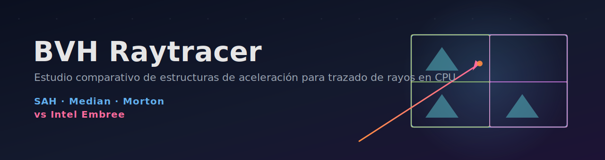

<p align="center">
  
</p>

<p align="center">
  <em>Ray tracer por software (CPU, multihilo) sobre un <b>BVH</b> — estudio comparativo de heurísticas de construcción, referencia con Intel Embree y backend GPU con OpenCL.</em>
</p>

<p align="center">
  
  
  
  
  
  
  
</p>

> Proyecto final — CS3014 Estructura de Datos Avanzados (2026-1).

---

Ray tracer por software cuya estructura central es un **BVH (Bounding Volume
Hierarchy)** construido con la **heurística de área de superficie (SAH)**
mediante *binning*. El proyecto es un **estudio comparativo** de tres backends:

| Backend | Dónde corre | Tecla |
|---|---|---|
| **Custom BVH** (SAH / Median / Morton) | CPU, multihilo | — |
| **Intel Embree 4** | CPU, SIMD AVX | — |
| **GPU OpenCL** | GPU (OpenCL 1.2) | `G` |

---

## ¿Qué es un BVH?

El ray tracer ingenuo prueba cada rayo contra **todos** los triángulos: `O(N)`
por rayo, `O(P·N)` por frame. Un BVH agrupa los triángulos en un **árbol de
cajas alineadas a los ejes (AABB)** anidadas: un rayo prueba primero las cajas
baratas y solo desciende por las que golpea, descartando subárboles enteros. El
costo por rayo baja de `O(N)` a `~O(log N)`.

La calidad del árbol depende de **cómo se divide** cada caja. Aquí comparamos
varias estrategias de construcción (ver *Roadmap*).

---

## Estructura del código

```
src/
  main.cpp                      # bucle principal + SDL
  sr_config.hpp                 # parseo de argumentos (--width --height --fps)
  math/                         # álgebra lineal (vec3/mat4, helpers)
  io/                           # stb_image (carga de texturas)
  renderer/
    bvh.hpp / bvh.cpp           # ★ BVH: build (SAH + binning) + traversal
    sr_renderer.*               # rasterizador (soft-renderer base)
    sr_geometry.*               # meshes + carga .ply
    sr_camera.*  sr_texture.*  sr_framebuffer.hpp  sr_text.*  sr_render_config.hpp
  game/
    sr_game.cpp                 # escena, trazado, sombras, reflejos, multihilo
res/textures/skybox3/           # cubemap del cielo
docs/                           # informe (LaTeX)
```

## Dependencias

El repositorio es **self-contained en Windows**: todas las dependencias están
incluidas en `third_party/`, `lib/` y `bin/` — no hay que instalar nada.

| Librería | Windows | macOS |
|---|---|---|
| **SDL2** | bundled (`lib/libSDL2.a`) | `brew install sdl2` |
| **Intel Embree 4** | bundled (`lib/embree4.lib`) | bundled (mismo repo) |
| **OpenCL** | bundled (`lib/libOpenCL.a`) | framework del sistema (incluido en macOS) |

## Estudio comparativo (benchmark)

Compara las estrategias de construcción del BVH y la referencia Embree sobre la
misma geometría, midiendo tiempo de build, render, **traversal puro** y **nodos
visitados por rayo**:

```sh
./build/bin/bvh_raytracer --bench          # genera docs/benchmark.csv
python3 docs/plot.py                       # genera las figuras docs/*.png
```

Resultado (resumen): SAH da el árbol de mejor calidad (menos nodos/ray); Morton
construye más rápido pero da el peor árbol; los kernels SIMD de Embree recorren
~3× más rápido que nuestra mejor SAH sobre los mismos triángulos.

## Cómo compilar y ejecutar

El repo es self-contained: no se necesita ninguna flag extra en Windows.

**Windows (MinGW):**
```sh
cmake -S . -B build -G "MinGW Makefiles" -DCMAKE_BUILD_TYPE=Release
cmake --build build -j

# Con backend GPU OpenCL:
cmake -S . -B build -G "MinGW Makefiles" -DWITH_OPENCL=ON
cmake --build build -j
```

**macOS / Linux:**
```sh
cmake -S . -B build -DCMAKE_BUILD_TYPE=Release
cmake --build build -j

# Con OpenCL en macOS (framework del sistema):
cmake -S . -B build -DWITH_OPENCL=ON
cmake --build build -j
```

**Ejecutar** (desde la raíz del repo, para que encuentre `res/`):
```sh
./build/bin/bvh_raytracer --width 1280 --height 720
# Windows:
build\bin\bvh_raytracer.exe --width 1280 --height 720
```

## Controles

- `TAB` — alternar rasterizador / ray tracer
- `B` — alternar BVH (rápido) vs fuerza bruta `O(N)` (lento)
- `V` — superponer las cajas del BVH (debug)
- `G` — **alternar GPU OpenCL** / CPU (solo si se compiló con `-DWITH_OPENCL=ON`)
- `M` — **menú de opciones** (escena ciudad/esferas, densidad, reflejos, nº de rebotes, etc.); navega con ↑/↓ y cambia con ←/→
- `WASD` + ratón — cámara/caminar · `ESPACIO`/`SHIFT` subir/bajar (en vuelo) · **doble `ESPACIO`** alterna caminar ↔ volar · `ESC` salir

## Cargar modelos OBJ

El proyecto incluye un cargador de Wavefront `.obj` con **sombreado suave**
(normales por vértice interpoladas). Deja tus modelos en `res/models/` y cárgalos
con `load_obj("res/models/tu_modelo.obj", base, escala, albedo, reflectividad, tris)`
(ver el uso en `build_city`, donde se carga `sculpture.obj` — un toro— como pieza
central). Las superficies curvas (esferas, modelos) ya no se ven facetadas.

## Roadmap

- [x] Escenas procedurales (ciudad + esferas) con densidad configurable
- [x] Menú de opciones en pantalla (`[M]`)
- [x] Heurísticas de construcción (SAH / Median / Morton) seleccionables
- [x] Métricas + benchmark reproducible + gráficas comparativas
- [x] Referencia externa Intel Embree (opcional)
- [x] Sombreado suave + cargador OBJ
- [x] Backend GPU OpenCL 1.2 (tecla `G`)
- [ ] Visualización de la ruta de un rayo por el árbol (demo)
- [ ] Reporte LaTeX + presentación + video

## Autores

- *(tu nombre)*
- *(compañeros)*

## Referencias

1. J. Goldsmith, J. Salmon. *Automatic Creation of Object Hierarchies for Ray Tracing*. IEEE CG&A, 1987.
2. D. MacDonald, K. Booth. *Heuristics for Ray Tracing Using Space Subdivision*. 1990. — la SAH.
3. I. Wald. *On Fast Construction of SAH-based Bounding Volume Hierarchies*. 2007. — construcción por *binning*.
4. T. Möller, B. Trumbore. *Fast, Minimum Storage Ray/Triangle Intersection*. 1997.
5. A. Williams et al. *An Efficient and Robust Ray-Box Intersection Algorithm*. 2005.
6. M. Pharr, W. Jakob, G. Humphreys. *Physically Based Rendering* (4th ed.), 2023. Ch. 4.
